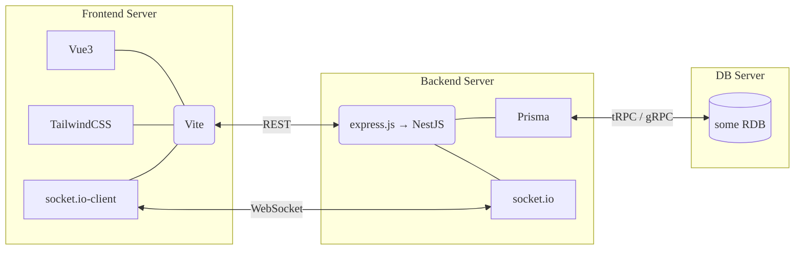

# プロジェクト構成

## 構成図

## 補足

- フロントとバックを分担して開発できるよう、別でサーバを立てる
- ~~フロントとバックそれぞれのバージョンを同期をさせるために、Nx を使ったモノレポ構成とする~~  
  モノレポを導入するとハードルが上がりすぎる可能性があり、また Nuxt3 を公式サポートしている管理ツールが存在しないので、マルチレポで運用する
- ~~将来的にビンゴ以外のゲームを追加することを踏まえ、フロントエンドにはルーティング可能な Nuxt3 をフレームワークとして採用する~~  
  Nuxt の安定版は Vue3 が未サポートなため、Vite でプロジェクト作成する
- 基本的に TypeScript で開発したいので、バックエンドは express.js で始めてもいいが、ゆくゆくは NestJS に置き換えたい
- DB はビンゴゲームのリリース時点では不要なので、技術選定は仮
